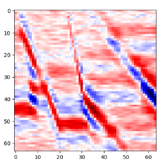

# seismic inversion by using diffusion model

This is the codes for [Unsupervised Seismic Acoustic Impedance Inversion Based on Generative Diffusion Model](https://arxiv.org/abs/2102.09672).

https://library.seg.org/doi/abs/10.1190/geo2024-0416.1

## Abstract
Seismic acoustic impedance, defined as the product of rock density and seismic velocity, is essential for identifying different rock layers and their contents. Seismic acoustic impedance inversion is a crucial technique for deriving high-resolution impedance profiles, aiding in the interpretation of subsurface geological structures, reservoir identification, and lithological characterization. While deep learning-based methods have become a new inversion paradigm, they often require high-quality labeled data and accurate low-frequency impedance models to produce high-resolution impedance profiles. We propose an unsupervised seismic acoustic impedance inversion method based on a generative diffusion model to address the above-mentioned limitations. Our approach begins by training the generative diffusion model using low-frequency impedance models as the conditional input, allowing it to capture the complex prior distribution from the training data. We then incorporate an explicit physical measurement model into the diffusion model sampling process to approximate the posterior distribution. The proposed method mitigates the dependency on low-frequency impedance and enhances inversion performance. Notably, the proposed method is an unsupervised inversion framework, effectively addressing the inverse problem without the constraints of measurements and labeled data requirements. Synthetic and field data experiments validate the proposed method, demonstrating superior accuracy compared to supervised deep learning, unsupervised deep learning, and regularization methods.
## Requirements
- pylops 2.0.0 
## Preparation
1. Clone this repository and navigate to it in your terminal. Then run:
```bash
git clone https://github.com/GeoAI-INV/SAII-DDPM.git
cd SAII-DDPM
pip install -e .
```

2. Download Pre-trained Checkpoints:
From the [link](https://drive.google.com/file/d/1TW0MGoc-7fYFpMftK7Qn1h6xMM4p1MO0/view?usp=drive_link), download the checkpoint and unzip it to ./logger/weights


## Sampling
just a demo, maybe not the best results

```
python scripts/image_sample.py 
```
The training process is the same as https://github.com/openai/improved-diffusion


# observed data and true model
 
# sampling results 


## Notation
The codes are revised based on https://github.com/openai/improved-diffusion and https://github.com/DPS2022/diffusion-posterior-sampling/tree/main

Also, we use https://pylops.readthedocs.io/en/stable/ for some model-driven inverse methods.


## Citation
If you find our work interesting, please consider citing
```
@article{
doi:10.1190/geo2024-0416.1,
title = {Unsupervised Seismic Acoustic Impedance Inversion Based on Generative Diffusion Model},
author = {Hongling Chen  and  Jie Chen  and  Mauricio Sacchi  and  Jinghuai Gao  and  Ping Yang },
journal = {GEOPHYSICS},
year = {2025},
doi = {10.1190/geo2024-0416.1},
```